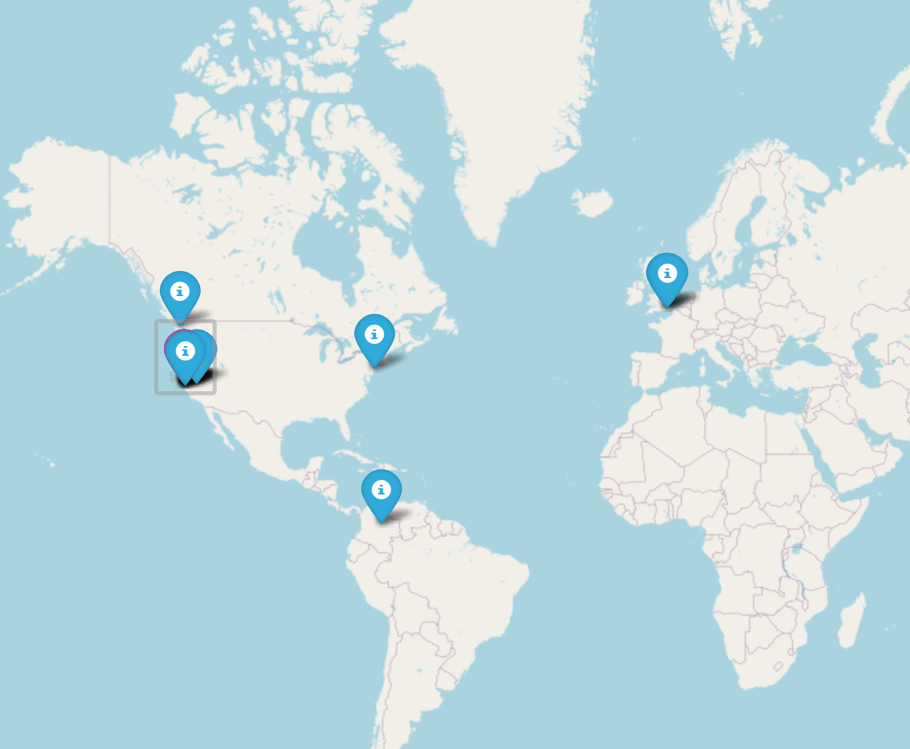
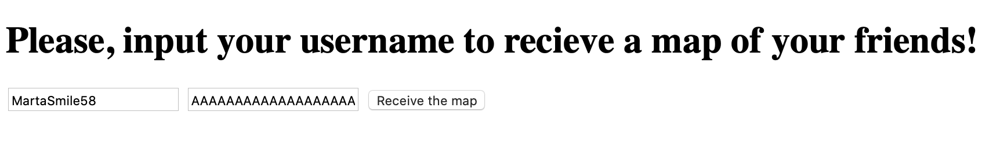

This program allowes the user to create the map of people the user is following on Twitter
User have to enter his username and his access toker. The program will generate the map.

The module use geopy, requests, flask and folium modules

There is 5 functions:

- twitter_friends(user_name, token)
- get_coordinates(address)
- map(followers_coordinates)
- index()
- friends_map()

This is the example of generated map:

The example of the main page:

